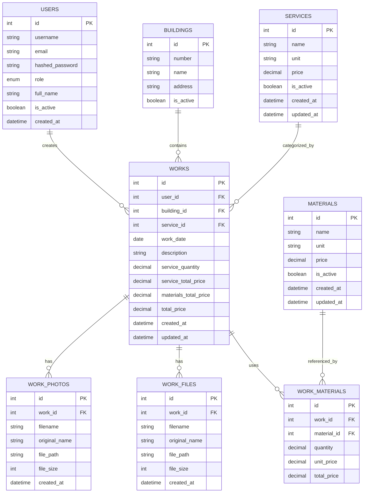

# Схема базы данных

## ER-диаграмма



## Таблицы

### `users`

Пользователи системы.

| Поле | Тип | Описание |
|------|-----|----------|
| `id` | SERIAL PRIMARY KEY | ID пользователя |
| `username` | VARCHAR(50) UNIQUE NOT NULL | Логин |
| `email` | VARCHAR(100) UNIQUE | Email |
| `hashed_password` | VARCHAR(255) NOT NULL | Хеш пароля (bcrypt) |
| `role` | VARCHAR(20) NOT NULL | Роль: `contractor`, `director`, `admin` |
| `full_name` | VARCHAR(100) | ФИО |
| `phone` | VARCHAR(20) | Телефон |
| `is_active` | BOOLEAN DEFAULT TRUE | Активен ли пользователь |
| `created_at` | TIMESTAMP DEFAULT NOW() | Дата создания |
| `updated_at` | TIMESTAMP DEFAULT NOW() | Дата обновления |

**Индексы:**
- `idx_users_username` — поиск по логину
- `idx_users_role` — фильтрация по роли

### `buildings`

Корпуса / объекты.

| Поле | Тип | Описание |
|------|-----|----------|
| `id` | SERIAL PRIMARY KEY | ID корпуса |
| `number` | VARCHAR(20) NOT NULL | Номер корпуса |
| `name` | VARCHAR(100) | Название корпуса |
| `address` | VARCHAR(255) | Адрес |
| `is_active` | BOOLEAN DEFAULT TRUE | Активен ли |
| `created_at` | TIMESTAMP DEFAULT NOW() | Дата создания |

**Индексы:**
- `idx_buildings_number` — поиск по номеру
- `idx_buildings_is_active` — фильтрация активных

### `services`

Справочник видов работ / услуг.

| Поле | Тип | Описание |
|------|-----|----------|
| `id` | SERIAL PRIMARY KEY | ID услуги |
| `name` | VARCHAR(255) NOT NULL | Наименование работы |
| `unit` | VARCHAR(50) | Единица измерения (м, м², шт и т.д.) |
| `price` | DECIMAL(12,2) NOT NULL | Цена за единицу (руб.) |
| `is_active` | BOOLEAN DEFAULT TRUE | Активна ли запись |
| `created_at` | TIMESTAMP DEFAULT NOW() | Дата создания |
| `updated_at` | TIMESTAMP DEFAULT NOW() | Дата обновления |

**Индексы:**
- `idx_services_name` — поиск по названию
- `idx_services_is_active` — фильтрация активных

### `materials`

Справочник материалов.

| Поле | Тип | Описание |
|------|-----|----------|
| `id` | SERIAL PRIMARY KEY | ID материала |
| `name` | VARCHAR(255) NOT NULL | Наименование материала |
| `unit` | VARCHAR(50) | Единица измерения (м, кг, шт и т.д.) |
| `price` | DECIMAL(12,2) NOT NULL | Цена за единицу (руб.) |
| `is_active` | BOOLEAN DEFAULT TRUE | Активна ли запись |
| `created_at` | TIMESTAMP DEFAULT NOW() | Дата создания |
| `updated_at` | TIMESTAMP DEFAULT NOW() | Дата обновления |

**Индексы:**
- `idx_materials_name` — поиск по названию
- `idx_materials_is_active` — фильтрация активных

### `works`

Основная таблица — записи о выполненных работах.

| Поле | Тип | Описание |
|------|-----|----------|
| `id` | SERIAL PRIMARY KEY | ID работы |
| `user_id` | INTEGER NOT NULL REFERENCES users(id) | Кто создал запись |
| `building_id` | INTEGER NOT NULL REFERENCES buildings(id) | Корпус |
| `service_id` | INTEGER NOT NULL REFERENCES services(id) | Вид работы |
| `work_date` | DATE NOT NULL | Дата выполнения работы |
| `description` | TEXT | Наименование / описание работы |
| `service_quantity` | DECIMAL(10,2) | Количество по виду работы |
| `service_unit_price` | DECIMAL(12,2) | Цена за единицу работы (на момент создания) |
| `service_total_price` | DECIMAL(12,2) | Сумма по работам = quantity × unit_price |
| `materials_total_price` | DECIMAL(12,2) | Сумма по материалам |
| `total_price` | DECIMAL(12,2) | Общая сумма |
| `created_at` | TIMESTAMP DEFAULT NOW() | Дата создания записи |
| `updated_at` | TIMESTAMP DEFAULT NOW() | Дата обновления |

**Индексы:**
- `idx_works_user_id` — фильтрация по подрядчику
- `idx_works_building_id` — фильтрация по корпусу
- `idx_works_service_id` — фильтрация по виду работ
- `idx_works_work_date` — фильтрация по дате
- `idx_works_created_at` — сортировка по дате создания

### `work_materials`

Связующая таблица: какие материалы использованы в работе и в каком количестве.

| Поле | Тип | Описание |
|------|-----|----------|
| `id` | SERIAL PRIMARY KEY | ID записи |
| `work_id` | INTEGER NOT NULL REFERENCES works(id) ON DELETE CASCADE | Работа |
| `material_id` | INTEGER NOT NULL REFERENCES materials(id) | Материал |
| `quantity` | DECIMAL(10,2) NOT NULL | Количество |
| `unit_price` | DECIMAL(12,2) NOT NULL | Цена за единицу (на момент создания) |
| `total_price` | DECIMAL(12,2) NOT NULL | Сумма = quantity × unit_price |

**Индексы:**
- `idx_work_materials_work_id` — поиск материалов по работе
- `idx_work_materials_material_id` — агрегация по материалу

**Уникальность:**
- `UNIQUE(work_id, material_id)` — один материал в работе один раз

### `work_photos`

Фотографии к работе.

| Поле | Тип | Описание |
|------|-----|----------|
| `id` | SERIAL PRIMARY KEY | ID фото |
| `work_id` | INTEGER NOT NULL REFERENCES works(id) ON DELETE CASCADE | Работа |
| `filename` | VARCHAR(255) NOT NULL | Имя файла на диске |
| `original_name` | VARCHAR(255) | Оригинальное имя файла |
| `file_path` | VARCHAR(500) NOT NULL | Путь к файлу |
| `file_size` | INTEGER | Размер в байтах |
| `mime_type` | VARCHAR(50) | Тип файла (image/jpeg и т.д.) |
| `created_at` | TIMESTAMP DEFAULT NOW() | Дата загрузки |

**Индексы:**
- `idx_work_photos_work_id` — поиск фото по работе

### `work_files`

Документы / файлы к работе.

| Поле | Тип | Описание |
|------|-----|----------|
| `id` | SERIAL PRIMARY KEY | ID файла |
| `work_id` | INTEGER NOT NULL REFERENCES works(id) ON DELETE CASCADE | Работа |
| `filename` | VARCHAR(255) NOT NULL | Имя файла на диске |
| `original_name` | VARCHAR(255) | Оригинальное имя файла |
| `file_path` | VARCHAR(500) NOT NULL | Путь к файлу |
| `file_size` | INTEGER | Размер в байтах |
| `mime_type` | VARCHAR(50) | Тип файла |
| `created_at` | TIMESTAMP DEFAULT NOW() | Дата загрузки |

**Индексы:**
- `idx_work_files_work_id` — поиск файлов по работе

## SQL DDL

```sql
-- Пользователи
CREATE TABLE users (
    id SERIAL PRIMARY KEY,
    username VARCHAR(50) UNIQUE NOT NULL,
    email VARCHAR(100) UNIQUE,
    hashed_password VARCHAR(255) NOT NULL,
    role VARCHAR(20) NOT NULL CHECK (role IN ('contractor', 'director', 'admin')),
    full_name VARCHAR(100),
    phone VARCHAR(20),
    is_active BOOLEAN DEFAULT TRUE,
    created_at TIMESTAMP DEFAULT CURRENT_TIMESTAMP,
    updated_at TIMESTAMP DEFAULT CURRENT_TIMESTAMP
);

CREATE INDEX idx_users_username ON users(username);
CREATE INDEX idx_users_role ON users(role);

-- Корпуса
CREATE TABLE buildings (
    id SERIAL PRIMARY KEY,
    number VARCHAR(20) NOT NULL,
    name VARCHAR(100),
    address VARCHAR(255),
    is_active BOOLEAN DEFAULT TRUE,
    created_at TIMESTAMP DEFAULT CURRENT_TIMESTAMP
);

CREATE INDEX idx_buildings_number ON buildings(number);
CREATE INDEX idx_buildings_is_active ON buildings(is_active);

-- Виды работ / услуги
CREATE TABLE services (
    id SERIAL PRIMARY KEY,
    name VARCHAR(255) NOT NULL,
    unit VARCHAR(50),
    price DECIMAL(12,2) NOT NULL,
    is_active BOOLEAN DEFAULT TRUE,
    created_at TIMESTAMP DEFAULT CURRENT_TIMESTAMP,
    updated_at TIMESTAMP DEFAULT CURRENT_TIMESTAMP
);

CREATE INDEX idx_services_name ON services(name);
CREATE INDEX idx_services_is_active ON services(is_active);

-- Материалы
CREATE TABLE materials (
    id SERIAL PRIMARY KEY,
    name VARCHAR(255) NOT NULL,
    unit VARCHAR(50),
    price DECIMAL(12,2) NOT NULL,
    is_active BOOLEAN DEFAULT TRUE,
    created_at TIMESTAMP DEFAULT CURRENT_TIMESTAMP,
    updated_at TIMESTAMP DEFAULT CURRENT_TIMESTAMP
);

CREATE INDEX idx_materials_name ON materials(name);
CREATE INDEX idx_materials_is_active ON materials(is_active);

-- Работы
CREATE TABLE works (
    id SERIAL PRIMARY KEY,
    user_id INTEGER NOT NULL REFERENCES users(id),
    building_id INTEGER NOT NULL REFERENCES buildings(id),
    service_id INTEGER NOT NULL REFERENCES services(id),
    work_date DATE NOT NULL,
    description TEXT,
    service_quantity DECIMAL(10,2),
    service_unit_price DECIMAL(12,2),
    service_total_price DECIMAL(12,2),
    materials_total_price DECIMAL(12,2) DEFAULT 0,
    total_price DECIMAL(12,2),
    created_at TIMESTAMP DEFAULT CURRENT_TIMESTAMP,
    updated_at TIMESTAMP DEFAULT CURRENT_TIMESTAMP
);

CREATE INDEX idx_works_user_id ON works(user_id);
CREATE INDEX idx_works_building_id ON works(building_id);
CREATE INDEX idx_works_service_id ON works(service_id);
CREATE INDEX idx_works_work_date ON works(work_date);
CREATE INDEX idx_works_created_at ON works(created_at);

-- Материалы в работе
CREATE TABLE work_materials (
    id SERIAL PRIMARY KEY,
    work_id INTEGER NOT NULL REFERENCES works(id) ON DELETE CASCADE,
    material_id INTEGER NOT NULL REFERENCES materials(id),
    quantity DECIMAL(10,2) NOT NULL,
    unit_price DECIMAL(12,2) NOT NULL,
    total_price DECIMAL(12,2) NOT NULL,
    UNIQUE(work_id, material_id)
);

CREATE INDEX idx_work_materials_work_id ON work_materials(work_id);
CREATE INDEX idx_work_materials_material_id ON work_materials(material_id);

-- Фото работ
CREATE TABLE work_photos (
    id SERIAL PRIMARY KEY,
    work_id INTEGER NOT NULL REFERENCES works(id) ON DELETE CASCADE,
    filename VARCHAR(255) NOT NULL,
    original_name VARCHAR(255),
    file_path VARCHAR(500) NOT NULL,
    file_size INTEGER,
    mime_type VARCHAR(50),
    created_at TIMESTAMP DEFAULT CURRENT_TIMESTAMP
);

CREATE INDEX idx_work_photos_work_id ON work_photos(work_id);

-- Файлы работ
CREATE TABLE work_files (
    id SERIAL PRIMARY KEY,
    work_id INTEGER NOT NULL REFERENCES works(id) ON DELETE CASCADE,
    filename VARCHAR(255) NOT NULL,
    original_name VARCHAR(255),
    file_path VARCHAR(500) NOT NULL,
    file_size INTEGER,
    mime_type VARCHAR(50),
    created_at TIMESTAMP DEFAULT CURRENT_TIMESTAMP
);

CREATE INDEX idx_work_files_work_id ON work_files(work_id);

-- История бэкапов
CREATE TABLE backup_logs (
    id SERIAL PRIMARY KEY,
    backup_id VARCHAR(100) NOT NULL UNIQUE,
    backup_type VARCHAR(20) NOT NULL CHECK (backup_type IN ('full', 'photos')),
    created_by INTEGER NOT NULL REFERENCES users(id),
    total_size_mb INTEGER,
    parts_count INTEGER NOT NULL DEFAULT 1,
    filters JSONB,
    metadata JSONB,
    file_paths TEXT[],
    status VARCHAR(20) DEFAULT 'completed' CHECK (status IN ('pending', 'processing', 'completed', 'failed')),
    created_at TIMESTAMP DEFAULT CURRENT_TIMESTAMP,
    completed_at TIMESTAMP
);

CREATE INDEX idx_backup_logs_type ON backup_logs(backup_type);
CREATE INDEX idx_backup_logs_created_at ON backup_logs(created_at);
CREATE INDEX idx_backup_logs_status ON backup_logs(status);
```

## Особенности

1. **Историчность цен:** В таблице `works` и `work_materials` цены дублируются (не только ссылка на справочник, но и фактическая цена на момент создания). Это гарантирует, что изменение цены в справочнике не пересчитает старые записи.

2. **Каскадное удаление:** Фото, файлы и материалы автоматически удаляются при удалении работы (`ON DELETE CASCADE`).

3. **Soft delete:** Справочники (`materials`, `services`, `buildings`) используют флаг `is_active` вместо физического удаления.
